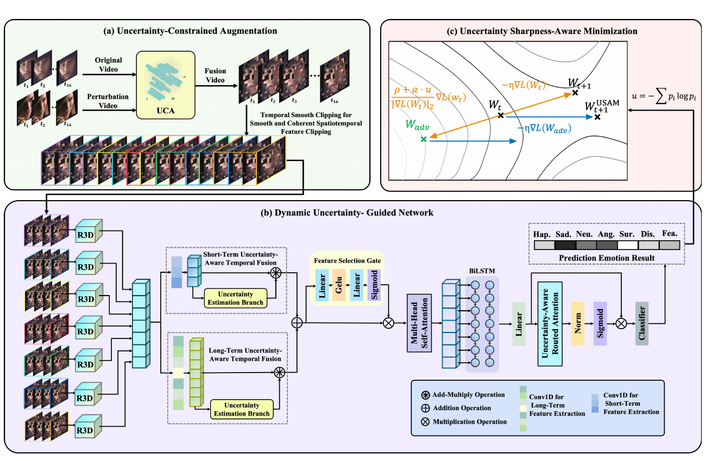

# [IEEE TMM'26] From Uncertainty to Certainty: A Robust Dynamic Facial Expression Recognition Framework via Dynamic Uncertainty Constraint Modeling

(August, 2026) Our paper "From Uncertainty to Certainty: A Robust Dynamic Facial Expression Recognition Framework via Dynamic Uncertainty Constraint Modeling" has been accepted by IEEE Transactions on Multimedia.

## Abstract

Various uncertainties stem from unpredictable expression evolution, data uncertainty, and unrobust models, significantly downgrading the performance of dynamic facial expression recognition (DFER). While deep learning-based methods have made remarkable progress, they often struggle to effectively handle these uncertainties, inevitably limiting their performance in complex real-world scenarios. To deal with these uncertainties, we propose an efficient and robust DFER framework called Uncertainty Suppression Flow (UnSFlow), which integrates three uncertainty suppression modules, namely: Uncertainty-Constrained Augmentation (UCA), Dynamic Uncertainty-Guided Network (DUGN), and Uncertainty Sharpness-Aware Minimization (USAM). Firstly, to mitigate expression evolution uncertainty, by introducing appropriate randomness, UCA is introduced to enhance data diversity while maintaining augmentation consistency. Subsequently, by integrating the uncertainty estimation branch for quantitative uncertainty modeling and uncertainty-aware routing attention for adaptive feature refinement, DUGN is designed to suppress data uncertainty through hybrid spatiotemporal modeling. Finally, to tackle model uncertainty, USAM regulates gradient perturbations via predictive uncertainty to stabilize parameter updates and enhance robustness for minority-class and ambiguous samples, thereby achieving uncertainty-adaptive optimization. Extensive experiments on two widely used in-the-wild datasets, DFEW and FERV39k, demonstrate that UnSFlow achieves competitive or superior performance compared with representative DFER methods in terms of recognition accuracy, computational efficiency, and robustness, providing a practical and effective solution for real-world dynamic facial expression recognition.

## Acknowledgments

The project is designed on [DFEW](https://github.com/jiangxingxun/DFEW), [FERV39k](https://github.com/wangyanckxx/FERV39k), [SAM](https://github.com/davda54/sam), and [M3DFEL](https://github.com/Tencent/TFace/blob/master/attribute/M3DFEL/README.md), thanks to these works!
